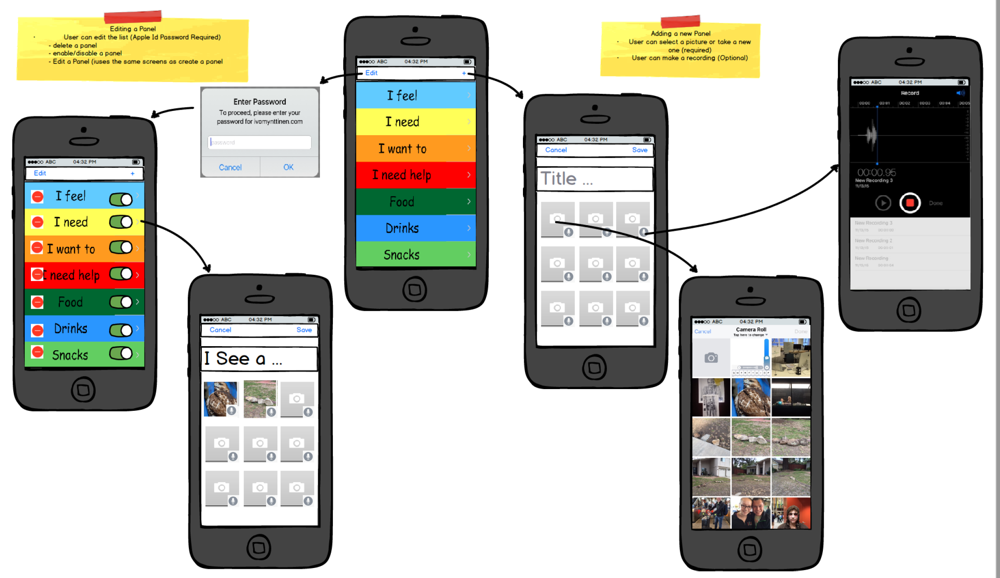
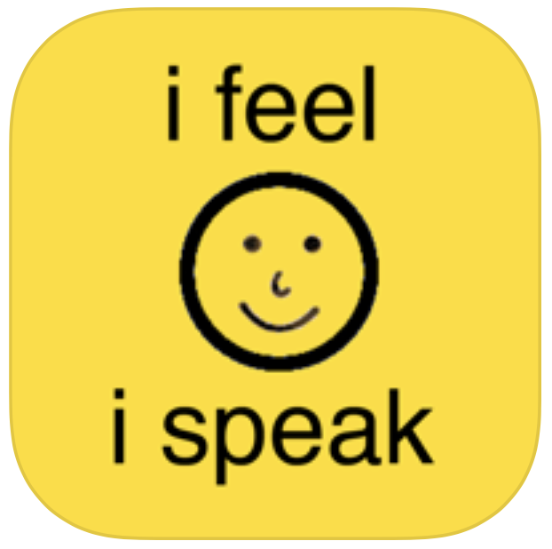

# iInteract: i Feel, i Speak
Created By:  Jim Zucker[(LinkedIn)](https://www.linkedin.com/in/jamesazucker/), Cathy DeMarco, Tricia Zucker[(LinkedIn)](https://www.linkedin.com/in/triciazucker/)

 

## Upcoming 2.0 release will include
The big news is version 2.0, we are going to allow you to create your own pages using your own pictures and sounds!

Above is the proposed story board for version 2.0 to make the application configurable.  We are trying to make it intuitive and use standard iPhone interactions based on:
*   Arrange items on a page - we used the Clock application screen for alarms 
*   Adding Pictures - General pattern for adding a picture for a placeholder (like the you set a profile picture 
*   RecordingSound - based on the 'Messages' app 

 
## Overview

iInteract: i Feel, i Speak app for the iPhone, iPod touch and iPad is used by parents, therapists and special education teachers to promote basic communication skills.

iInteract is a portable basic communication board that a child can utilize to communicate their wants and needs on the go. Our app provides visual pictures paired with audio feedback. In the iInteract menu you can select a boy/girl voice so that your child can relate to the auditory response.

There are seven communication board choices that a child/caregiver or teacher can utilize to identify wants and needs as well as feelings. Each communication board has three to four picture choices that once touched enlarge and speak, sharing what the child has requested. A must have app for emerging communicators! 

## Background

The application is based on the widely used practice to create communication boards that are used to help the children interact on a daily basis.

This application is a being developed jointly with my wife and her close friend who both have 20+ years helping children with special needs learn the skills necessary to live independent lives.

Our concept is to provide visual and audio feedback to the child's selection on the screen. In the future our thinking is to make it highly customizable and easy to navigate for daily activities and allow it to grow with the child.

## Release notes
* 1.7 - Enabled MacOS support
* 1.6 - Enabled Apple Watch support
* 1.5 - Sep 2020 Upgraded to Swift 5/XCode 12, Apple Watch support disabled
* 1.4 - Dec 11, 2015 Apple Watch support Added
* 1.3 - Dec 4, 2015 Application changed to be Free in the App Store
* 1.0 - 2010 Released
