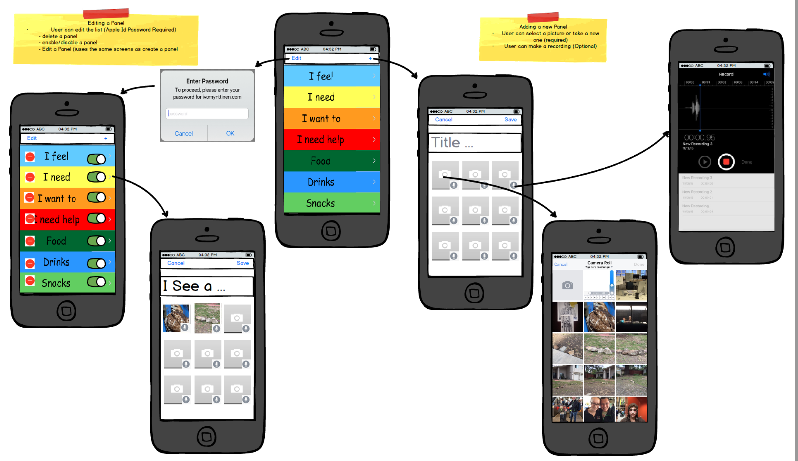
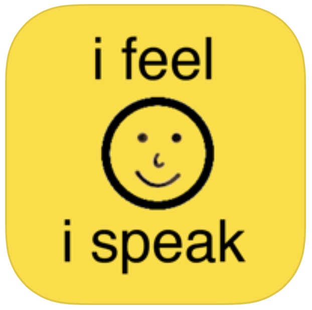

# iInteract: i Feel, i Speak
Created By:  Jim Zucker[(LinkedIn)](https://www.linkedin.com/in/jamesazucker/), Cathy DeMarco, Tricia Zucker[(LinkedIn)](https://www.linkedin.com/in/triciazucker/)

 

## What's new in 2.0

You choose how the app behaves. Open **Settings → iInteract → Mode**:

| Mode    | What you can do                                                                                                                       |
| ------- | ------------------------------------------------------------------------------------------------------------------------------------- |
| Default | The seven built-in panels behave exactly like 1.x. Pick a boy or girl voice and that's it.                                            |
| Custom  | Hide or reorder any built-in panel, **and** create your own panels with your own photos and recorded voices (up to 6 items per page). |

When Custom is on, the main screen shows a `+` button. Tap it to manage your panels — toggle visibility, drag to reorder, or add a new one with a name, color, photo, and a boy + girl voice you record yourself. Photo selection uses the standard iOS photo picker (modeled after profile-picture flows); voice recording uses the same pattern as Messages voice notes.

**Optional PIN protection.** From the editor's Security section you can set a 4-digit PIN that's required before the editor opens. Five wrong attempts trigger a one-minute lockout. If you ever forget the PIN you can reset it either by being signed into your iCloud account or by answering a security question you set when creating the PIN.

**Your data stays yours.** All custom photos, voices, panel titles, and your PIN stay on your device. If you're signed into iCloud, panel titles, layouts, and the PIN sync between your devices through your personal iCloud account (key-value storage). **Nothing is ever sent to us or any third party.** See [PrivacyPolicy.md](PrivacyPolicy.md).

 
## Overview

iInteract: i Feel, i Speak app for the iPhone, iPod touch and iPad is used by parents, therapists and special education teachers to promote basic communication skills.

iInteract is a portable basic communication board that a child can utilize to communicate their wants and needs on the go. Our app provides visual pictures paired with audio feedback. In the iInteract menu you can select a boy/girl voice so that your child can relate to the auditory response.

There are seven communication board choices that a child/caregiver or teacher can utilize to identify wants and needs as well as feelings. Each communication board has three to four picture choices that once touched enlarge and speak, sharing what the child has requested. A must have app for emerging communicators! 

## Background

The application is based on the widely used practice to create communication boards that are used to help the children interact on a daily basis.

This application is a being developed jointly with my wife and her close friend who both have 20+ years helping children with special needs learn the skills necessary to live independent lives.

Our concept is to provide visual and audio feedback to the child's selection on the screen. In the future our thinking is to make it highly customizable and easy to navigate for daily activities and allow it to grow with the child.

## Release notes
* 2.0 - Configurable panels: hide/reorder built-ins, create your own panels with photos and recorded voices, optional PIN protection, iCloud sync of titles + layouts (custom photos and audio stay local)
* 1.7 - Enabled MacOS support
* 1.6 - Enabled Apple Watch support
* 1.5 - Sep 2020 Upgraded to Swift 5/XCode 12, Apple Watch support disabled
* 1.4 - Dec 11, 2015 Apple Watch support Added
* 1.3 - Dec 4, 2015 Application changed to be Free in the App Store
* 1.0 - 2010 Released
